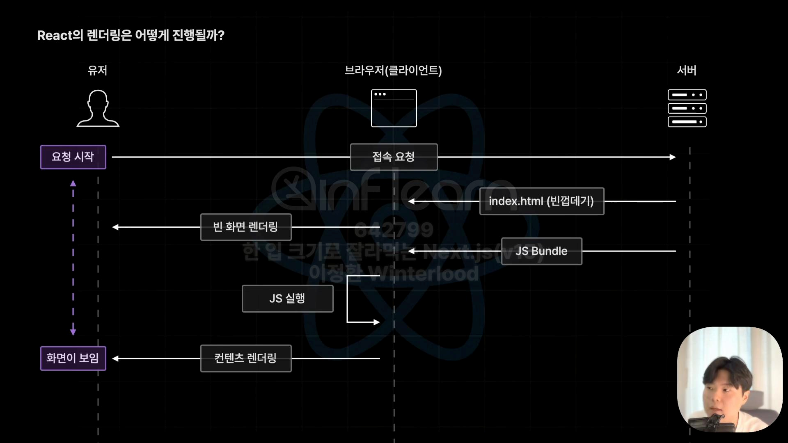
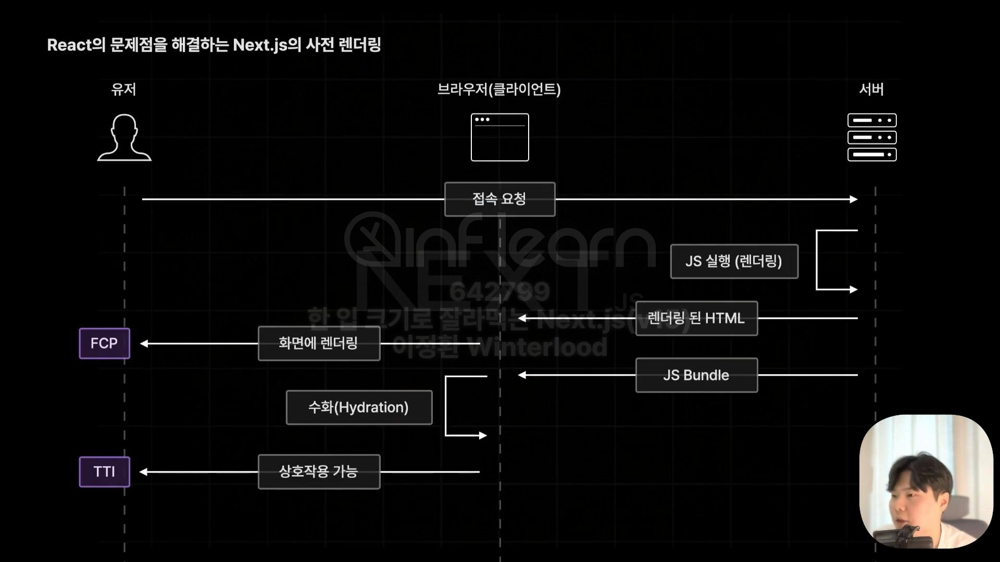
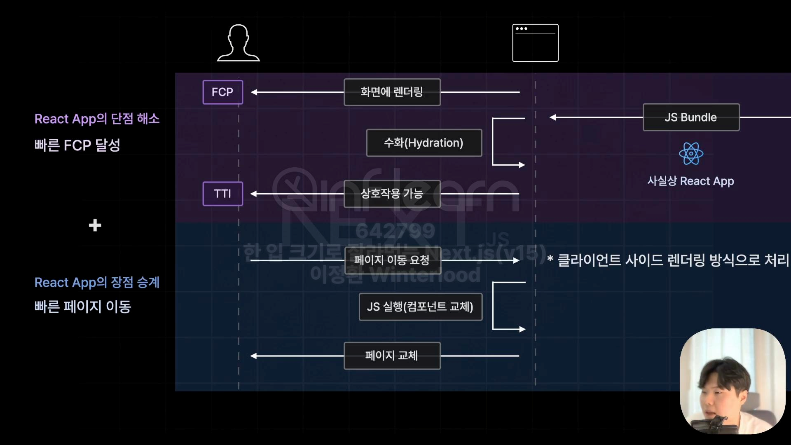

## 사전 렌더링 
- 브라우저의 요청에 사전에 렌더링이 완료된 HTML을 응답하는 렌더링 방식
- Client Side Rendering의 단점을 효율적으로 해결하는 기술

### 

Client Side Rendering이란?

<H3>Client Side Rendering(CSR)</H3>
<ul>
  <li>클라이언트(브라우저)에서 직접 화면을 렌더링 하는 방식</li>
</ul>

<li>JS Bundle <- 해당 서비스에서 접근 가능한 모든 컴포넌트 코드 존재</li>
<H4>장/단점</H4>
<ul>
  <li>장점: 초기 접속 이후의 페이지 이동이 빠름</li>
  <li>단점: 초기 렌더링 시간(FCP)이 오래 걸림</li>
</ul>

### 사전 렌더링 방식

- FCP에서는 인터렉션(상호작용_페이지 이동 등) 불가(∵서버로부터 HTML 파일 하나만 받음)
- 수화(Hydration): 브라우저가 서버로부터 받은 자바스크립트 코드(리액트 앱)를 직접 실행해서 HTML과 연결 => 이후부터 인터렉션 가능
- TTL(Time To Interactive): 상호작용이 가능해진 시점
> JS 실행(렌더링)과 화면 렌더링
> - JS 실행(렌더링): 자바스크립트 코드(React 컴포넌트)를 HTML로 변환하는 과정
> - 화면에 렌더링: HTML 코드를 브라우저가 화면에 그려내는 작업

- 이후 요청은 기존 React와 같이 페이지를 교체하는 방식으로 처리됨