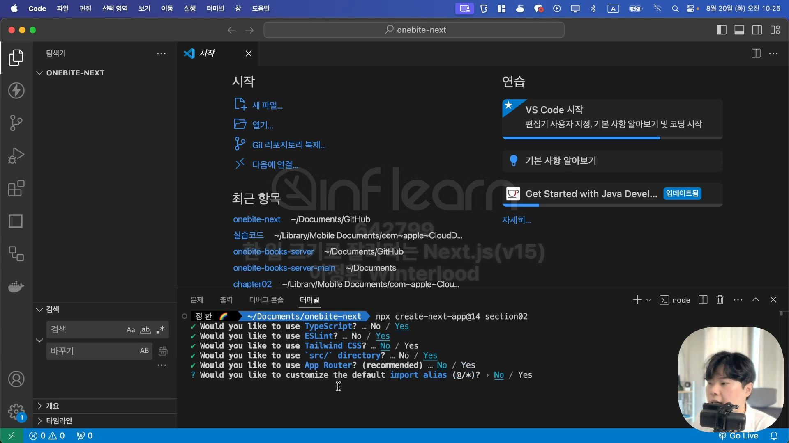
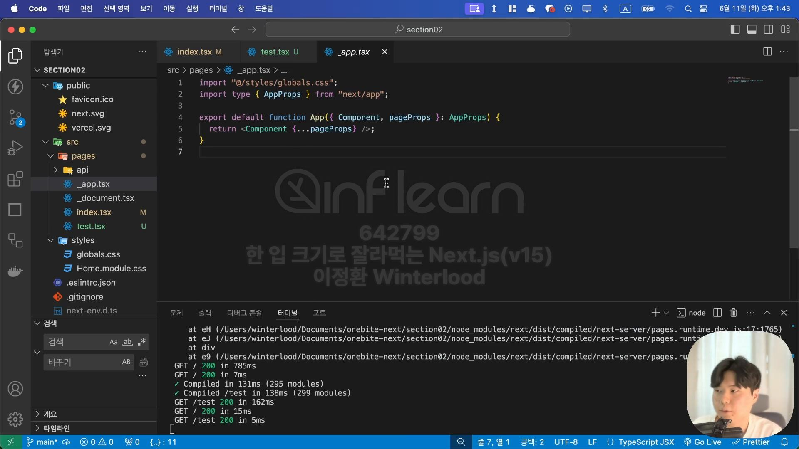
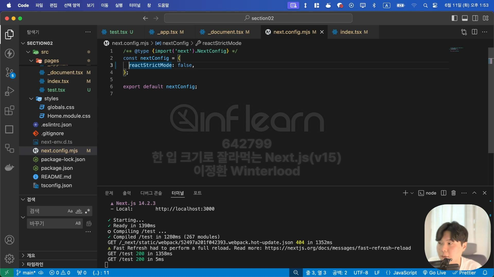

- [Page Router](#page-router)
- [Next.JS App 생성하기](#nextjs-app-생성하기)
  - [앱 생성](#앱-생성)
  - [앱 실행](#앱-실행)
- [앱 구조](#앱-구조)
    - [\_app.tsx](#_apptsx)
    - [\_document.tsx](#_documenttsx)
    - [next.config.mjs](#nextconfigmjs)


# Page Router

- Pages라는 폴더의 구조를 기반으로 페이지를 라우팅 해줌


- 폴더를 기준으로 라우팅을 설정할 수 있음


- 동적 경로 설정도 가능
- `[파일명].js`라는 형식으로 파일을 생성하면 동적 경로 설정이 됨


# Next.JS App 생성하기

## 앱 생성
```
npx create-next-app@14 앱이름
```
<details>
<summary></summary>
<div markdown = '1'>
<ul>
  <li>npx: Node Package Executor</li>
  <li>create-next-app: 새로운 Next.JS의 앱을 생성하는 NodeJS의 패키지</li>
  <li>@14: (버전)14버전</li>
</ul>

<H3>추가 설정</H3>

</div>
</details>

## 앱 실행
```
npm run dev
```

# 앱 구조
### _app.tsx

- React의 App 컴포넌트와 같은 역할
- Next.JS의 페이지 역할을 하는 컴포넌트들의 부모 역할
- 모든 페이지에 나타나야할 요소가 있다면 해당 파일의 return문 안에 넣어주면 됨

```js
export default function App({ Component, pageProps }: AppProps)
```
- 위에서 Component는 현재 페이지 역할을 할 Page를 받는 props
- pageProps는 Component에 전달될 props들을 객체로 묶어서 보관한 것

### _document.tsx

- 모든 페이지에 공통적으로 적용되어야 하는 HTML 코드
  - React의 index.html과 공통의 역할을 하는 셈
- 모든 페이지에 적용되어야 하는 메타 태그, 폰트, 캐릭터 셋 등의 태그를 관리

### next.config.mjs

- 실습을 위해 false로 설정
- true로 되어있을 경우 잠재적인 문제를 검사하기 위해 개발모드로 실행했을 때 컴포넌트를 두 번 실행하게됨 => 디버깅 불편함