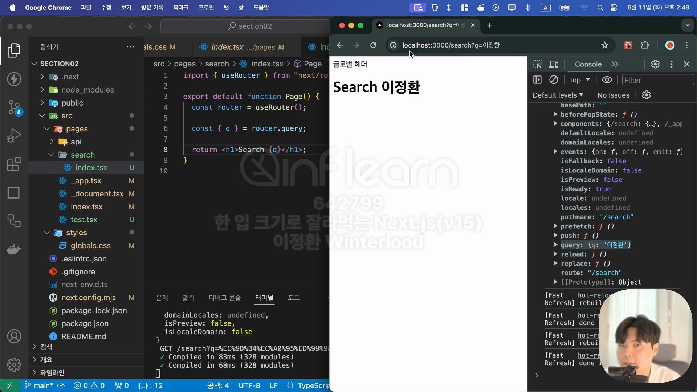
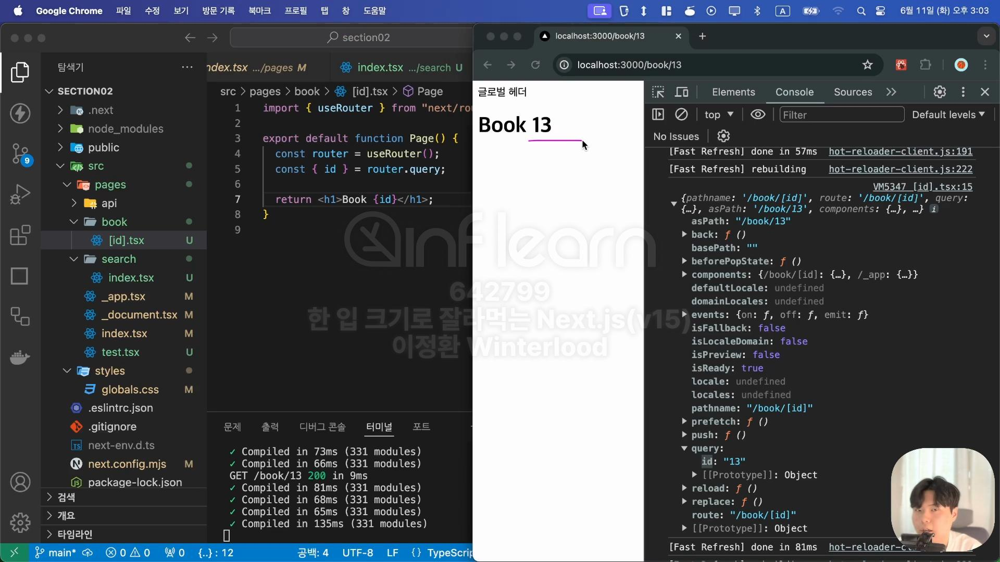

- [동적 경로 설정](#동적-경로-설정)
  - [쿼리](#쿼리)
    - [useRouter](#userouter)
  - [파라미터](#파라미터)
    - [\[id\].tsx\_단일 파라미터](#idtsx_단일-파라미터)
    - [\[...id\].tsx\_다중 파라미터(Catch All Segment)](#idtsx_다중-파라미터catch-all-segment)
    - [\[\[...id\]\].tsx\_Optional Catch All Segment](#idtsx_optional-catch-all-segment)
- [커스텀 404 페이지](#커스텀-404-페이지)


# 동적 경로 설정
## 쿼리
### useRouter
```
import {useRouter} from "next/router"
```
- 쿼리 스트링의 값을 쓰기 위해서 추가해야 하는 import 문
- 라우터 객체를 반환해줌
> 참고 ) `import {useRouter} from "next/navigation"`은 app router에서 사용하는 것


- `const {q} = router.query` 를 통해 쿼리의 값을 q에 저장할 수 있음

## 파라미터
### [id].tsx_단일 파라미터 
- 파라미터를 이용해 동적 경로를 만들고자 한다면 Pages폴더 아래 폴더를 만들어 `[파라미터 변수명].tsx` 파일을 생성하면 됨
- 파라미터 값은 쿼리의 방식과 마찬가지로 useRouter를 이용해서 값을 꺼내 쓸 수 있음


- `localhost:3000/Book/책번호`의 동적 경로 생성 예
- 만약 파일 명을 `[id].tsx`가 아닌 `[abc].tsx`로 했다면 파라미터에 대응되는 키는 id가 아니라 abc가 됨

### [...id].tsx_다중 파라미터(Catch All Segment)
- 파일명을 `[...파라미터 변수명].tsx`로 설정할 경우 `localhost:3000/Book/1/2/3/4/5/6/7`와 같은 경로에 접근해도 에러가 발생하지 않음
- `Book/`뒤에 붙은 아이디를 다 쓰겠다는 뜻으로 해석됨

> 다만 book폴더 아래 index.tsx파일이 없기 때문에 `localhost:3000/Book` 경로로 접근하면 에러가 발생함


- 전달 받은 파라미터 값들은 배열 형태로 저장됨

### [[...id]].tsx_Optional Catch All Segment

- 다중 파라미터도 받을 수 있고, index.tsx 파일이 없어도 `localhost:3000/Book`에 접근 가능한 범용적인 방법


# 커스텀 404 페이지
- 존재하지 않는 경로로 접근했을 때 사용자에게 보여질 화면 커스텀
- pages 폴더 아래 `404.tsx`파일을 만들어서 페이지를 구성해주면 됨

