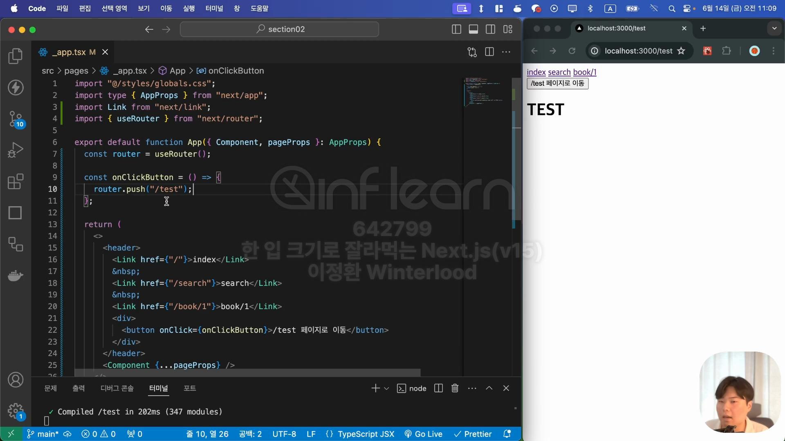

# 네비게이팅(CSR 방식)
> a 태그의 경우 CSR(Client Side Rendering) 방식이 아니라 서버에게 매번 새로운 페이지를 요청해 페이지를 이동하는 방식이므로 비교적 느림

## Link
```js
import Link from "next/link"

<Link href={"이동할 경로"}>설명</Link>
```

- `_app.tsx`의 header영역에 네비게이션을 만든 예

> `&nbsp;`: 띄어쓰기

## 이벤트 핸들러를 통한 이동
- useRouter을 이용함

### router.push()

- 이벤트 핸들러 안에 `router.push("이동할 경로")`를 작성하면 이벤트 핸들러가 동작했을 때 "이동할 경로"로 경로 이동이 됨

### router.replace()
- 뒤로가기를 방지하며 페이지 이동

### router.back()
- 페이지를 뒤로 이동