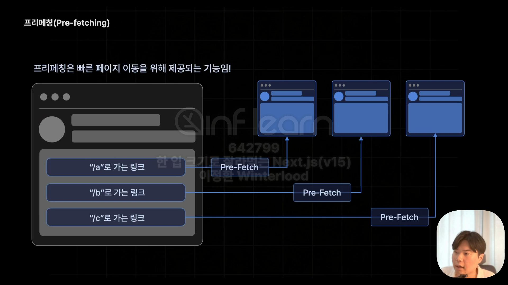
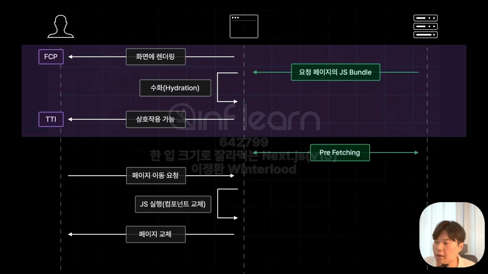
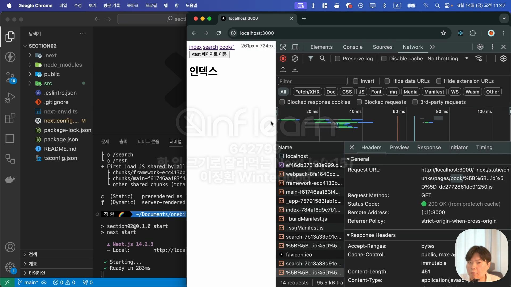

- [프리패칭(Pre-Fetching)](#프리패칭pre-fetching)
  - [프리패칭 확인](#프리패칭-확인)
      - [빌드](#빌드)
      - [프로덕션 모드로 실행](#프로덕션-모드로-실행)
  - [명시적으로 프리패칭하는 방법](#명시적으로-프리패칭하는-방법)
  - [Link 컴포넌트의 프리패칭을 강제로 해제하는 방법](#link-컴포넌트의-프리패칭을-강제로-해제하는-방법)


# 프리패칭(Pre-Fetching)

- 프리패칭: 페이지를 사전에 불러오는 것



- 처음 서버가 브라우저에게 JS Bundle을 전달할 때 현재 페이지에 필요한 JS Bundle만 전달됨
  - 용량 경량화로 인해 Hydration 시간이 단축됨
- 이후 현재 페이지에서 이동할 수 있는 페이지들(Link 태그로 네비게이팅 된 페이지)을 Pre Fetching함

## 프리패칭 확인
- 빌드 과정을 거친 후에 프로덕션 모드로 확인 가능
> 개발모드(`npm run dev`)로는 프리패칭 확인 불가

#### 빌드
```
npm run build
```
#### 프로덕션 모드로 실행
```
npm run start
```


- Network 탭에서 프리패칭 확인 가능
- 단, 이벤트가 발생했을 때 페이지가 이동되는 '/test' 페이지의 경우 프리패칭되지 않음

## 명시적으로 프리패칭하는 방법
```js
import { useRouter } from "next/router";
import { useEffect } from "react";

// 생략
  const router = useRouter()

  
  useEffect(() => {
    router.prefetch('/test') // 프리패칭을 시키는 함수
  }, [])
```

## Link 컴포넌트의 프리패칭을 강제로 해제하는 방법
```js
// 생략
  <Link href = {"/search"} prefetch={false}>search</Link>
// 생략
```
- search페이지의 프리패칭이 강제 해제 예시

▼ `_app.tsx` 파일 전체 코드
```js
import "@/styles/globals.css";
import type { AppProps } from "next/app";
import Link from "next/link";
import { useRouter } from "next/router";
import { useEffect } from "react";

export default function App({ Component, pageProps }: AppProps) {
  const router = useRouter()

  const onClickButton = () => {
    router.push("/test")
  }

  useEffect(() => {
    router.prefetch('/test')
  }, [])
  
  return (
  <>
    <header>
      <Link href={"/"}>index</Link>
      &nbsp;
      <Link href={"/search"} prefetch={false}>search</Link>
      &nbsp;
      <Link href={"/book/1"}>book/1</Link>
      <div>
        <button onClick={onClickButton}>/test 페이지로 이동</button>
      </div>
    </header>
    <Component {...pageProps} />
  </>
  );
}
```