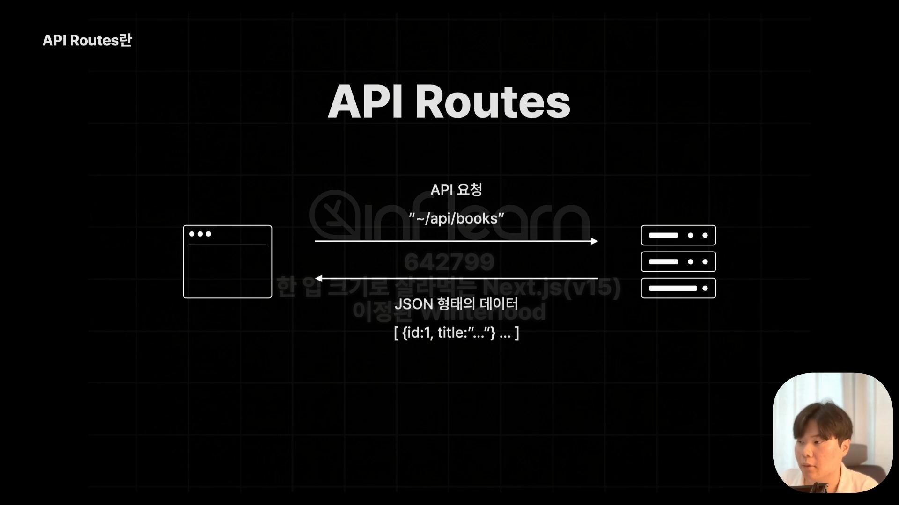
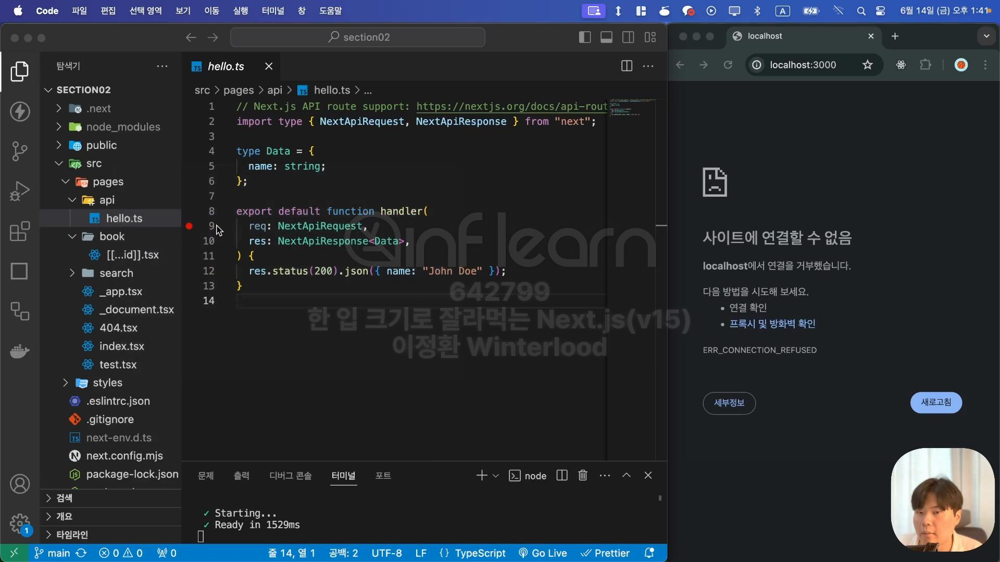
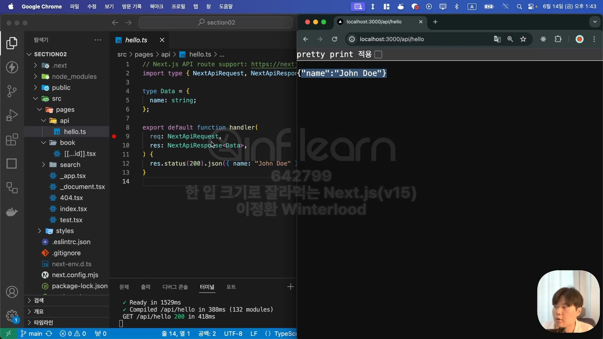
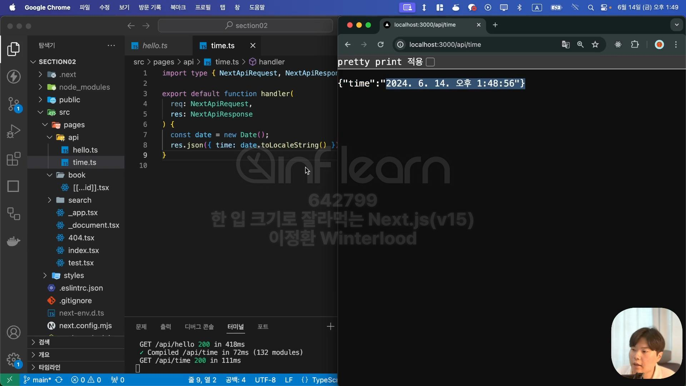

# API Routes
- Next.JS에서 API를 구축할 수 있게 해주는 기능
- 백엔드 API 서버가 하는 일과 같이 간단한 API를 구축해서 클라이언트로부터 요청을 받아 DB에서 데이터를 꺼내오는 등의 일을 할 수 있음



- pages폴더 안 api폴더 아래 파일을 생성해주면 해당 파일은 웹페이지가 아닌 API Routes로써 설정이 됨


- handler라는 함수가 실행되어 API가 작동
<details>
<summary>handler 함수 상세</summary>
<div markdown = '1'>
<ul>
  <li>매개변수: request, response에 대한 정보</li>
  <li>status메서드를 통해 상태 코드 200번으로 설정</li>
  <li>response객체의 json 메서드를 통해 {name: "John Doe"}객체를 응답</li>
</ul>
</div>
</details>


- `localhose:3000/api/hello`로 접속했을 때의 화면


## 실습_현재 시간을 반환하는 API 만들기
- api 요청 경로: `localhose:3000/api/time`



```ts
// Pages/api/time.ts

import type { NextApiRequest, NextApiResponse } from "next";

export default function handler(
  req: NextApiRequest,
  res: NextApiResponse,
) {
  const date = new Date()
  res.json({time: date.toLocaleString()})
}
```