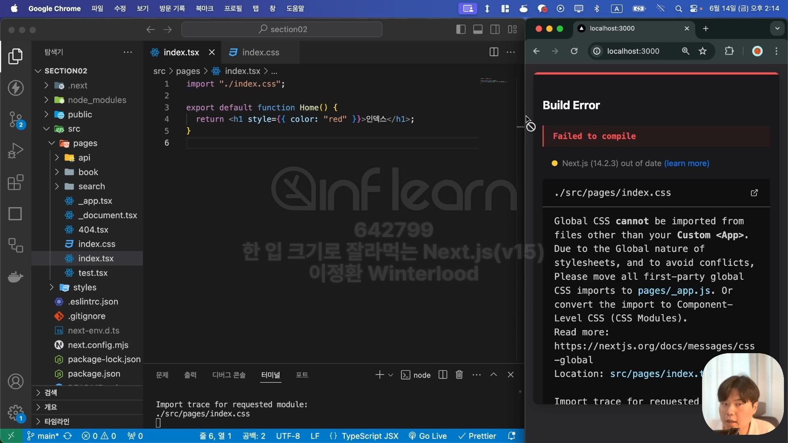
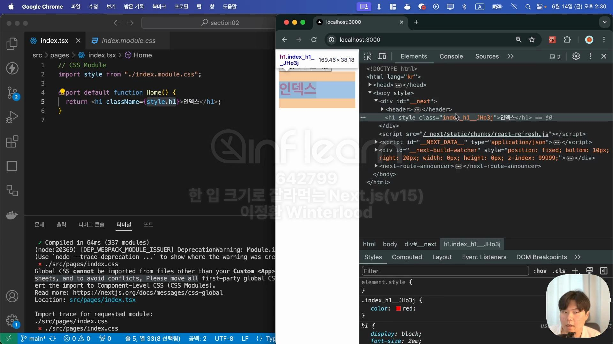

- [스타일링](#스타일링)
  - [인라인 방식](#인라인-방식)
  - [외부 스타일 방식](#외부-스타일-방식)
    - [CSS Module](#css-module)


# 스타일링
## 인라인 방식
- 기존의 React에서 쓰던 방식과 같음
- h1태그의 글자 색을 빨간색으로 바꾸는 인라인 방식 예
```ts
export default function Home() {
  return <h1 style={{color: "red"}}>인덱스</h1>
}
```

## 외부 스타일 방식

- Next.JS에서는 App 컴포넌트가 아닌 곳에서는 글로벌 CSS 파일을 불러올 수 없도록 막아놓음

**아래와 같은 상황을 방지하기 위함**
- index.tsx에 적용할 index.css파일에 h1태그의 스타일을 정의해 놓음
- test.tsx에 적용할 test.css파일에 h1태그의 스타일을 정의해 놓음
=> 만약 index페이지에서 test 페이지로 이동할 경우 h1 태그의 스타일 충돌 발생

### CSS Module
- 기존의 CSS 파일을 마치 모듈처럼 사용할 수 있도록 도와주는 기술
- 클래스 네임들을 자동으로 유니크한 이름으로 파일마다 변환을 시켜주는 기능
- Nest.JS에서 외부 스타일 방식을 사용할 때 사용
- 
**index.tsx에 적용할 css파일을 만드는 예**
1. css파일 명을 `index.css`가 아닌 `index.module.css`로 설정
2. `index.tsx`파일에서 `import style form "./index.module.css"`로 import 하기
  > => index.module.css 파일 안에 들어있는 모든 클래스 네임들이 자동으로 유니크한 값으로 변환되어 `style`이라는 객체 안에 저장됨



**전체 코드**
```ts
// index.tsx
import style from "./index.module.css"

export default function Home() {
  return <h1 className={style.h1}>인덱스</h1>
}
```
```css
/* index.module.css */
.h1 {
  color: red;
}
```