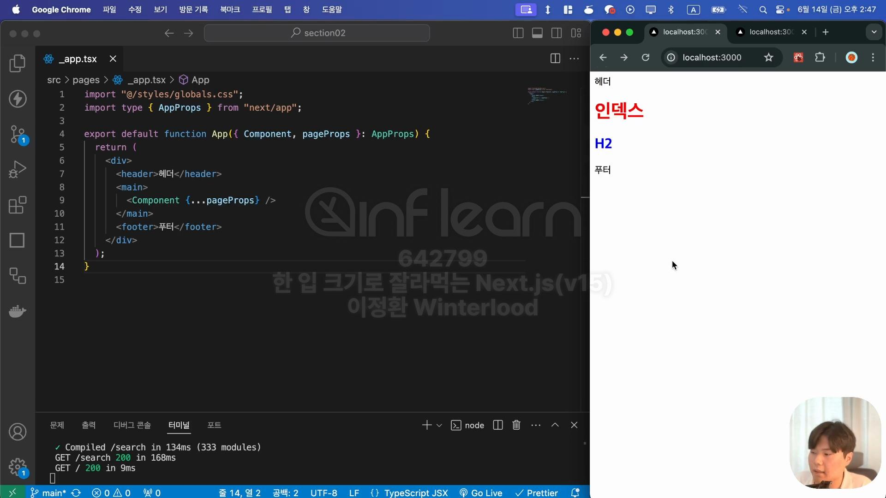
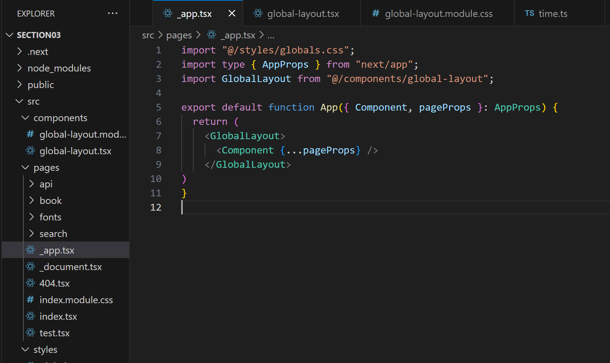
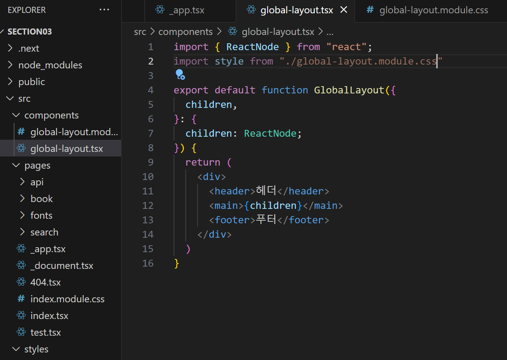
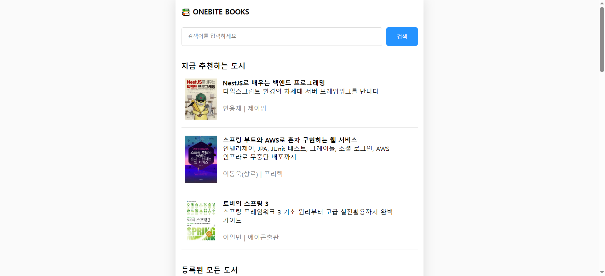
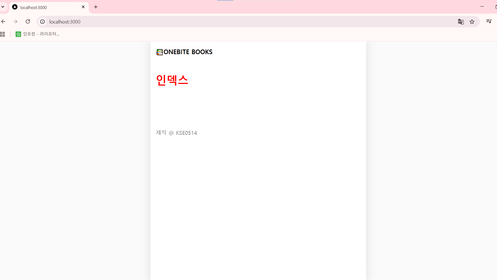

- [글로벌 레이아웃 설정하기](#글로벌-레이아웃-설정하기)
  - [실습](#실습)


# 글로벌 레이아웃 설정하기

- 글로벌 레이아웃은 _app.tsx 파일에서 설정하면 됨
- 하지만 _app.tsx 파일에서 레이아웃을 나누고 작성하다보면 _app.tsx 파일 내 코드가 길어지기 때문에 src 폴더 아래 components 폴더를 만들어 아래와 같이 따로 레이아웃 컴포넌트를 만드는 방식을 주로 이용

|_app.tsx|global-layout.tsx|
|:-:|:-:|
|||

- `global-layout.tsx` 생성 위치: `src/components/global-layout.tsx`

## 실습

- 이미지와 같이 레이아웃 설계하기

1. 배경색 회색톤으로 설정하기
  - _app.tsx의 css는 globals.css에서 설정
  ```css
  /* styles/globals.css */
  html, 
  body{
    margin: 0px;
    padding: 0px;
    background-color: rgb(250, 250, 250);
  }
  ```
2. 레이아웃 css 작업하기
  - `src/components/golbal-layout.module.css`에서 css 작업
```ts
// src/components/golbal-layout.tsx
import { ReactNode } from "react";
import style from "./global-layout.module.css"
import Link from "next/link";

export default function GlobalLayout({
  children,
}: {
  children: ReactNode;
}) {
  return (
    <div className={style.container}>
      <header className={style.header}>
        <Link href={"/"}>📚ONEBITE BOOKS</Link>
      </header>
      <main className={style.main}>{children}</main>
      <footer className={style.footer}>제작 @ KSE0514</footer>
    </div>
  )
}
```
```css
/* src/components/golbal-layout.module.css */
.container {
  background-color: white;
  max-width: 600px;
  min-height: 100vh;
  margin: 0 auto;

  box-shadow: rgba(100, 100, 100, 0.2) 0px 0px 29px 0px;
  padding: 0px 15px;
}

.header {
  height: 60px;

  font-size: 18px;
  font-weight: bold;
  line-height: 60px;
} 
.header > a{
  color: black;
  text-decoration: none;
}

.main {
  padding-top: 10px;
}

.footer {
  padding: 100px 0px;
  color: gray;
}
```
- 결과물
- 